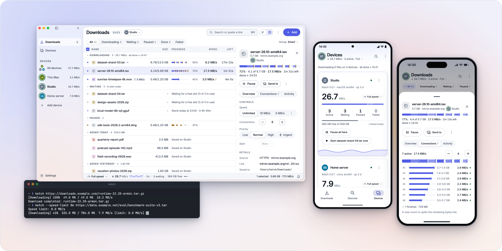

<p align="center">
  <picture>
    <source media="(prefers-color-scheme: dark)" srcset="art/icon-white.svg">
    <source media="(prefers-color-scheme: light)" srcset="art/icon-app.svg">
    
  </picture>
</p>

<h1 align="center">Ketch</h1>

<p align="center">
  <a href="README.md">English</a> ·
  <a href="README.zh-CN.md">简体中文</a> ·
  <a href="README.es.md">Español</a> ·
  <a href="README.ja.md">日本語</a> ·
  <b>Deutsch</b> ·
  <a href="README.fr.md">Français</a>
</p>

<p align="center">
  <b>Ein schneller, quelloffener Downloadmanager für all deine Geräte.</b><br>
  macOS · Windows · Linux · Android · iOS · Web · Kommandozeile<br>
  Eine Kotlin Multiplatform-Bibliothek zum Einbetten in deine eigene Anwendung.
</p>

<p align="center">

[](https://github.com/linroid/Ketch/releases/latest)
[](https://central.sonatype.com/namespace/com.linroid.ketch)
[](https://linroid.com/Ketch/)
[](https://github.com/linroid/Ketch/releases/latest)
[](app/ios/)
[](https://github.com/linroid/Ketch/releases/latest)
[](https://opensource.org/licenses/Apache-2.0)

</p>

<p align="center">
  <a href="#download"><b>Herunterladen</b></a> ·
  <a href="https://youtu.be/l8RCUYQfRrc"><b>Demo ansehen</b></a> ·
  <a href="#features"><b>Funktionen</b></a> ·
  <a href="#getting-started"><b>Erste Schritte</b></a> ·
  <a href="docs/developers.md"><b>Für Entwickler</b></a>
</p>

<p align="center">
  <picture>
    <source media="(prefers-color-scheme: dark)" srcset="art/showcase-dark.png">
    <source media="(prefers-color-scheme: light)" srcset="art/showcase-light.png">
    
  </picture>
</p>

<p align="center">
  <a href="https://youtu.be/l8RCUYQfRrc"><b>▶ Ketch in Aktion ansehen</b></a>
</p>

Ketch verteilt jeden Download auf parallele Verbindungen und zeigt jede als Spur mit
Live-Fortschritt.
Weblinks, FTP-Server, Torrents und Magnet-Links kommen an einem Ort zusammen. Kopple Laptop,
Smartphone und Heimserver, um die Downloads auf allen Geräten von jedem einzelnen aus zu verfolgen
und zu steuern.

**Du entwickelst eine eigene App?** Bette dieselbe Engine ein, die auch die Ketch-Apps nutzen: mit
parallelen Downloads, Pausieren und Fortsetzen, Warteschlangen und Tempolimits. Die Kotlin
Multiplatform-Bibliothek ist auf Maven Central verfügbar.
[Ketch integrieren →](docs/developers.md#quick-start)

> [!WARNING]
> 🚧 Ketch wird aktiv entwickelt und ist bisher nur als Release Candidate verfügbar. Es kann noch
> Probleme geben. Bitte [melde, was dir auffällt](https://github.com/linroid/Ketch/issues).

<a id="download"></a>

## Herunterladen

| Plattform | Bezugsquelle |
|---|---|
| macOS (Apple silicon, Intel) | `.dmg` der [neuesten Version][release] |
| Windows (x64, ARM64) | `.msi` oder portable `.zip` ohne Installation aus der [neuesten Version][release] ([zur portablen App](docs/updates.md#the-portable-windows-app)) |
| Linux (x64, ARM64) | `.deb` der [neuesten Version][release] |
| Android 8.0+ | `.apk` der [neuesten Version][release] |
| iOS 18+ | Mit Xcode aus dem Quellcode bauen ([`app/ios`](app/ios/)) |
| Web | [linroid.com/Ketch](https://linroid.com/Ketch/), um Ketch auf einem anderen Gerät zu steuern |
| Browsererweiterung | Chrome, Edge, Brave, Firefox und weitere: `.zip` der [neuesten Version][release] ([Installation](app/browser-extension/README.md#installing)) |
| Kommandozeile und Server | macOS, Linux und Windows: [Installationsskript](#run-ketch-on-a-server) oder [neueste Version][release] |
| Docker | NAS und Heimserver mit x64 und ARM64: `ghcr.io/linroid/ketch` ([Anleitung](docs/docker.md), mit TrueNAS und fnOS) |

Die Desktop-Apps bringen ihre Laufzeitumgebung mit; die Kommandozeile ist eine einzelne native
Binärdatei. Beide benötigen kein Java und aktualisieren sich über die hier veröffentlichten
Versionen: die Desktop-App über Einstellungen → Über, die Kommandozeile mit `ketch update`
([so funktionieren Updates](docs/updates.md)).

[release]: https://github.com/linroid/Ketch/releases/latest

<a id="features"></a>

## Funktionen

### Schnellere Downloads

- **Parallele Verbindungen** — Ketch teilt eine Datei in Bereiche auf und lädt sie gleichzeitig.
  Der Tab Verbindungen zeigt jede Verbindung als Spur mit eigener Geschwindigkeit. Während des
  Downloads kannst du Verbindungen hinzufügen oder entfernen.
- **Mehrere Netzwerke gleichzeitig** — Verteile einen Download auf WLAN, Ethernet und unter
  Android auch Mobilfunk ([so funktioniert es](docs/multiple-networks.md)).
- **Proxy** — Über den System-Proxy, einen HTTP- oder SOCKS5-Proxy mit Benutzername und Passwort
  oder ohne Proxy herunterladen, mit direkter Verbindung zu den Hosts deiner Wahl; auch für einen
  einzelnen Download ([Details](docs/proxy.md)).
- **Pausieren und fortsetzen, auch nach einem Neustart** — Ketch prüft vor dem Fortsetzen, ob sich
  die Datei auf dem Server geändert hat, und versucht fehlgeschlagene Verbindungen automatisch
  erneut.

### Alle Arten von Links

- **HTTP und HTTPS**, mit Cookies und Referrer der Seite, wenn die Browsererweiterung den Download
  übergibt.
- **FTP und FTPS**, mit parallelen Verbindungen und Fortsetzen.
- **BitTorrent und Magnet-Links** — v1-, v2- und Hybrid-Torrents mit Dateiauswahl und einer
  vollständig
  in Kotlin geschriebenen Engine ([Details](docs/torrent.md)).
- **HLS (`.m3u8`) und DASH (`.mpd`)** — Speichere zeitlich begrenzte, unverschlüsselte Streams als
  eine Mediendatei. Bei HLS-Master-Playlists wird die Variante mit der höchsten Bandbreite verwendet
  ([Unterstützung und Grenzen](docs/media.md)).
- Ketch kann Magnet-Links und `.torrent`-Dateien für dein System öffnen: Ein Klick im Browser oder
  Dateimanager führt direkt zu Ketch.

### Alle deine Geräte in einer App

- **Per QR-Code koppeln** — Öffne auf dem freizugebenden Gerät **Einstellungen → Freigabe** und
  wähle **Anderes Gerät zulassen**. Scanne den Code mit dem Smartphone oder kopiere den
  Kopplungslink. Du kannst das Gerät auch unter **Im Netzwerk suchen** auswählen und die Verbindung
  erlauben, sobald beide dieselben vier Ziffern zeigen.
- **Jedes Gerät in der Seitenleiste**, mit aktueller Geschwindigkeit und Zustand. Wechsle per
  Tastenkürzel oder öffne **Alle Geräte**, um sämtliche Downloads in einer Tabelle zu sehen.
- **Downloads zum passenden Gerät schicken** — Füge einen Link für ein beliebiges Gerät hinzu,
  ziehe ihn auf ein Gerät in der Seitenleiste oder sende beziehungsweise verschiebe einen Download
  auf ein anderes Gerät, ohne die Ansicht zu wechseln.
- **Ohne Oberfläche auf NAS oder Server** — `ketch server`, auch als
  [Docker-Image](docs/docker.md), startet dieselbe Engine mit REST-API und integrierter Web-App.
  Die Apps finden den Server in deinem Netzwerk.
- **Aus dem Terminal** — `ketch add`, `list`, `pause`, `resume` und `watch` steuern die Downloads
  der Ketch-App oder eines Servers aus dem Terminal oder einem Skript; `watch` gibt JSON-Zeilen aus
  ([CLI](cli/README.md#work-on-a-running-ketch)).

### Deine Bandbreite im Griff

- **Geschwindigkeitsmodi** — Volle Geschwindigkeit, **Drosselung** für mehr Spielraum bei
  Videoanrufen oder **Automatisch**, das nach einem Wochenplan zwischen beiden wechselt.
- **Jeden Download einzeln steuern** — Ändere Tempolimits, Verbindungszahlen und Prioritäten im
  laufenden Betrieb. **Dringend** pausiert einen weniger wichtigen Download und startet sofort.
- **Eine flexible Warteschlange** — Begrenze gleichzeitige Downloads insgesamt und pro Website,
  oder lege einen späteren Startzeitpunkt fest.

### Für deinen Alltag gemacht

- **Browsererweiterung** für Chrome, Edge, Brave, Firefox und weitere Browser: Sie übernimmt
  Downloads und Magnet-Links und ergänzt **Mit Ketch herunterladen** im Kontextmenü, für diesen
  Computer oder ein anderes Gerät ([Details](app/browser-extension/README.md)).
- **Einfügen und herunterladen** — Füge einen Link ein, mit der Möglichkeit zum Rückgängigmachen,
  oder lass Ketch Downloads für kopierte Links vorschlagen.
- **Mit der Tastatur bedienen** — Auf dem Desktop öffnet `⌘K` (`Ctrl+K` unter Windows und Linux)
  die Befehlspalette. Die Tastenkürzelübersicht zeigt alle Kombinationen.
- **Kategorieordner** — Videos, Musik, Dokumente und Archive landen nach Dateityp oder Website
  in eigenen Ordnern im Downloadordner: Starte mit den Vorschlägen unter
  **Einstellungen → Downloads** oder lege eigene Regeln fest.
- **Nach dem Download direkt öffnen** — Öffne eine Datei, zeige sie im Ordner oder ziehe sie
  heraus, direkt aus der Liste.
- **Auf jeder Plattform zu Hause** — Menüleiste oder Infobereich, Benachrichtigungen und Fortschritt
  im Dock und in der Taskleiste auf dem Desktop; Hintergrunddownloads unter Android und iOS 26.
- **Wach während Downloads** — Die Desktop- und Android-Apps halten das System vom selbstständigen
  Ruhezustand ab, solange Downloads laufen; der Bildschirm kann sich trotzdem ausschalten
  (**Einstellungen → Allgemein**).
- **Dein Stil, deine Sprache** — Helles und dunkles Design mit vier Akzentfarben, in English,
  简体中文, 繁體中文, 日本語, 한국어, Español, Português (Brasil), Deutsch und Français
  ([Übersetzungen](docs/development/localization.md)).

### Downloads mit KI finden (Vorschau)

- **Entdecken** — Beschreibe, was du suchst, etwa „die neueste Ubuntu-Server-ISO“. Ein KI-Agent
  durchsucht das Web, prüft Links und sortiert die gefundenen Downloads. Bei einem fehlgeschlagenen
  Download funktioniert **Andere Quelle suchen** genauso. Grenze die Suche mit weiteren Nachrichten
  ein, verwirf unerwünschte Ergebnisse und setze frühere Suchen aus dem Verlauf fort. Entdecken
  fragt
  vor dem Öffnen einer Website nach, sofern du es nicht schon erlaubt hast. Nutze deinen eigenen
  Modelldienst: OpenAI, Anthropic, Gemini, Ollama oder einen OpenAI-kompatiblen Dienst. Verfügbar in
  den Desktop- und Android-Apps sowie mit `ketch ai-discover`
  ([Einrichtung](docs/ai-discovery.md)).
- **MCP-Server** — Mit `ketch mcp` können KI-Assistenten die Downloads der Ketch-App oder eines
  Servers über das [Model Context Protocol](cli/README.md#mcp-server) starten, verfolgen und
  verwalten.

<a id="getting-started"></a>

## Erste Schritte

1. Installiere Ketch über [Herunterladen](#download) und öffne die App. Auf Smartphones fragen
   die Begrüßungsseiten nach dem Speicherort für Downloads.
2. Füge einen Download hinzu: Link einfügen (`⌘V` oder `Ctrl+V`), einen Link oder eine
   `.torrent`-Datei ins Fenster ziehen oder **Hinzufügen** wählen.
3. Um den Computer vom Smartphone aus zu steuern, öffne **Einstellungen → Freigabe**, wähle
   **Anderes Gerät zulassen** und scanne den QR-Code mit der Smartphone-Kamera.
4. Installiere die [Browsererweiterung](app/browser-extension/README.md), um Browserdownloads
   an Ketch zu senden.

<a id="run-ketch-on-a-server"></a>

### Ketch auf einem Server betreiben

Installiere die Kommandozeile unter macOS oder Linux. Unter Windows verwendest du die `.zip` der
[neuesten Version][release]:

```bash
curl -fsSL https://raw.githubusercontent.com/linroid/Ketch/main/install.sh | bash
```

Starte den Server mit REST-API und Web-App auf Port 8642:

```bash
ketch server
```

Füge ihn dann in der App unter **Geräte → Gerät hinzufügen** hinzu oder öffne
`http://<Serveradresse>:8642` im Browser. Die Kommandozeile kann auch selbst herunterladen:

```bash
ketch https://example.com/file.zip
```

Zugangscode, Port und weitere Optionen legst du in einer
[Konfigurationsdatei](cli/README.md#configuration-file) fest.
Die [CLI-Dokumentation](cli/README.md) beschreibt alle Befehle.

Auf einem NAS, oder überall, wo Docker läuft, startest du stattdessen das Image. Die
[Docker-Anleitung](docs/docker.md) beschreibt seine Einstellungen und die Schritte für TrueNAS und
fnOS:

```bash
docker run -d --name ketch --restart unless-stopped -e PUID=1000 -e PGID=1000 \
  -v /srv/ketch:/config -v /srv/downloads:/downloads \
  -p 8642:8642 -p 16881:16881 -p 16881:16881/udp ghcr.io/linroid/ketch
```

## Roadmap

- **Verteilung vor v1.0.0** — Signierte Windows-Versionen, signierte und notarisierte
  macOS-Versionen, Erweiterungen in den Browser-Stores und geprüfte Installations- und Updatewege
  ([Plan](docs/plans/v1-distribution.md))
- **Metalink** — Downloads von mehreren Spiegelservern gleichzeitig, mit Prüfsummen
- **WebDAV** — Downloads von WebDAV-Servern mit Fortsetzen
- **Weitere HLS- und DASH-Formate** — Qualität wählen, getrennte Audio- und Videospuren verbinden
  und AES-128-HLS-Verschlüsselung unterstützen; zeitlich begrenzte, unverschlüsselte Downloads aus
  einem einzelnen Stream werden bereits unterstützt
- **Medienextraktion** — Medien von Webseiten speichern
- **Ressourcensuche** — Herunterladbare Dateien auf einer Webseite finden
- **Prüfsummen** — Downloads gegen einen angegebenen oder vom Server veröffentlichten Hash prüfen
- **Schnellere segmentierte Downloads** — Früher fertige Verbindungen übernehmen den Rest langsamer
  Verbindungen, damit der Download nicht auf die langsamste warten muss
- **Stillstand erkennen und Wiederholungen einstellen** — Neu verbinden, wenn keine Daten mehr
  ankommen; Zeitlimits und Wiederholungszahlen wählen, auch unbegrenzt
- **Unfertige Dateien erkennbar machen** — Unter einem temporären Namen speichern und erst nach
  Abschluss den endgültigen Namen vergeben
- **Torrent-Dateien jederzeit wählen** — Nach Eingang der Magnet-Metadaten Dateien auswählen und
  die Auswahl während des Downloads ändern
- **Nach den Downloads** — Ketch optional beenden, den Computer in den Ruhezustand versetzen oder
  herunterfahren, sobald die Warteschlange leer ist
- **Automatisierung** — Bei Abschluss oder Fehlschlag einen Befehl ausführen oder Webhook aufrufen
- **Übertragung zwischen Geräten** — Senden an und Verschieben nach übertragen bereits geladene
  Daten, damit das andere Gerät fortsetzen kann, statt von vorn zu beginnen
  ([Plan](docs/plans/task-transfer.md))
- **Helfende Geräte** — Andere Geräte laden Teile derselben Datei über ihre eigene Verbindung
  und können währenddessen hinzugefügt oder entfernt werden
  ([Vorschlag](docs/design/multi-instance-downloads.md))

## Für Entwickler

**Bette Ketch in deine Anwendung ein.** Die Kotlin Multiplatform-Bibliothek bietet dieselbe
Download-Engine wie die Ketch-Apps, mit deiner eigenen Oberfläche und Anwendungslogik. Füge die
benötigten Module von Maven Central unter `com.linroid.ketch` hinzu.

Mit `core` und `ktor` läuft die Engine in deiner Android-, iOS- oder JVM-App. Node.js und WASI
können `core` mit einer eigenen HTTP-Engine verwenden. Mit `remote` steuerst du einen Ketch-Server
von Android, iOS, der JVM oder dem Browser aus über dieselbe `KetchApi`.

- [Entwicklerhandbuch](docs/developers.md) — Module, Schnellstart, REST-API und Erweiterungen
- [API-Referenz](docs/api.md) — Installation, Konfiguration, Prioritäten, Fehler und Logging
- [Architektur](docs/architecture.md) — Downloadablauf und Aufbau der Apps

## Dokumentation

Die folgenden ausführlichen Dokumente sind auf Englisch.

- [Kommandozeile](cli/README.md) — Downloads, Server, MCP, KI-Suche und Konfigurationsdatei
- [Browsererweiterung](app/browser-extension/README.md) — Einrichtung, Übernahme von Downloads,
  Berechtigungen und Datenschutz
- [BitTorrent](docs/torrent.md) — Unterstützung und Grenzen von Torrents und Magnet-Links
- [Mehrere Netzwerke](docs/multiple-networks.md) — Downloads auf Netzwerkschnittstellen verteilen
- [KI-Suche](docs/ai-discovery.md) — Anbieter, Schlüssel, Websuche, Seitenzugriff, Chats und Verlauf
- [Logging](docs/logging.md) — Speicherorte der Logs und Anhänge für Fehlerberichte

## Mitwirken

Beiträge sind willkommen! Öffne bitte ein Issue, um deine Idee vor einem PR zu besprechen.
Die [Stilregeln](docs/development/code-style.md), [Testregeln](docs/development/testing.md) und
[Lokalisierungsanleitung](docs/development/localization.md) beschreiben die Entwicklungsrichtlinien.
Auch Übersetzungen werden per Pull Request eingereicht.

Coding-Agenten sollten mit [AGENTS.md](AGENTS.md) beginnen, den gemeinsamen Anweisungen für alle
Agenten und Editoren. Lädt dein Tool diese Datei nicht automatisch, bitte es, vor Änderungen
`AGENTS.md` und die verlinkten Regeln zu lesen. Gemeinsame Anweisungen gehören in diese Dateien;
werkzeugspezifische Einstiegsdateien sollten nur darauf verweisen.

## Lizenz

Apache-2.0
