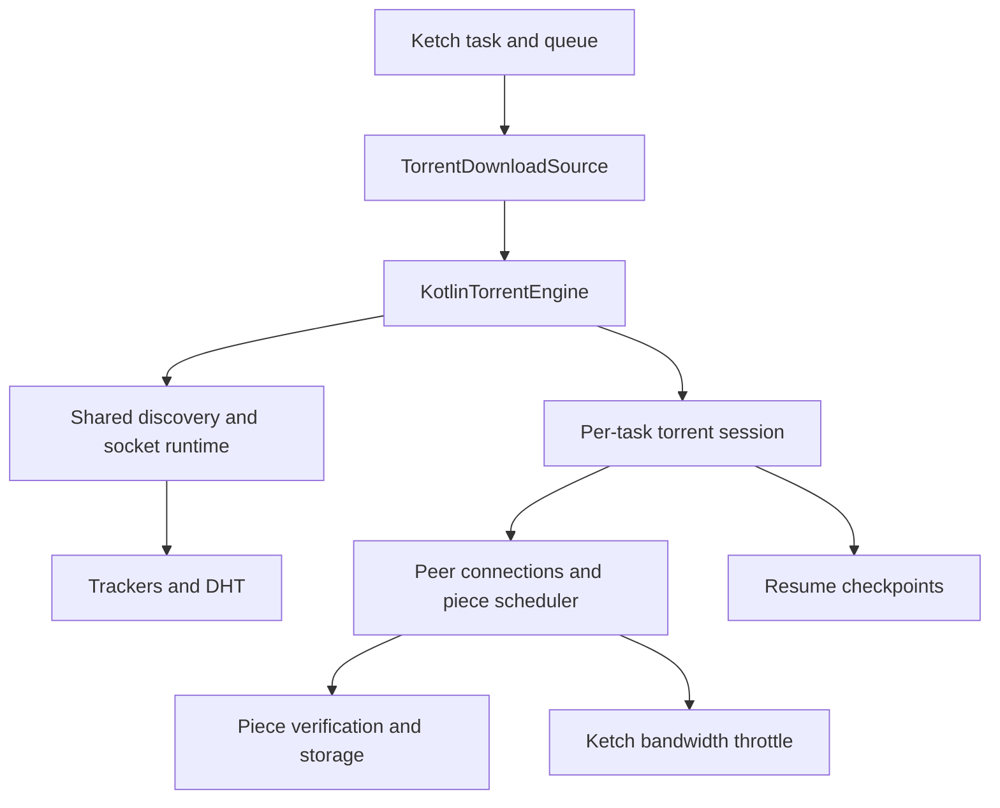

# Pure Kotlin torrent downloader roadmap

Status: **Approved 2026-09-08 — implementation in progress.**

Prepared 2026-09-07; final checkout inspected: `077a0c9d`. This document
authorizes no implementation by itself. After approval, deliver the agreed scope through the
stack below. It supersedes the backend choice in the historical
[BitTorrent assessment](kmp-expert-plan.md), not that document's approval status.

## Proposed outcome and scope

Replace libtorrent4j with a Kotlin Multiplatform BitTorrent v1 engine in `library:torrent`.
Keep `TorrentDownloadSource()` as the normal entry point. Deliver working downloads on JVM,
Android, and iOS, including desktop apps, CLI/daemon, and remote clients.

“Pure Kotlin” means torrent parsing, hashing, trackers, DHT, peer protocol, scheduling, storage
coordination, and resume logic are Kotlin, primarily in `commonMain`. Coroutines, Ktor, Okio,
Kotlin/Native, and platform socket/filesystem/TLS services remain acceptable dependencies.
No native torrent engine, JNI torrent bindings, external downloader process, or bundled
libtorrent binary may remain in the finished product.

| Included in this stack | Completion boundary |
| --- | --- |
| BitTorrent v1 | Single-file and multi-file metainfo, SHA-1 verification, TCP peers |
| Inputs | HTTP/HTTPS `.torrent` URLs, an SDK entry point for metainfo bytes, local `.torrent` files through CLI/app adapters, and `btih` magnets |
| Trackers | HTTP/HTTPS and UDP announces, compact and dictionary peer lists, tracker tiers and failover |
| Public peer discovery | DHT bootstrap, lookup and announcement; trackerless magnets; metadata exchange; PEX |
| Address families | IPv4 and IPv6 peers, trackers, and DHT where the host network supports them |
| Task behavior | Concurrent torrents, file selection, accurate progress, pause/resume, cancellation, deletion, live speed and connection limits |
| Upload behavior | Explicit upload policy, upload limits, and optional seeding after completion |
| Persistence | Versioned Kotlin resume state, verified restart recovery, and recovery of legacy tasks |
| Platforms | JVM 11+, Android minSdk 26, `iosArm64`, and `iosSimulatorArm64`, subject to the repository's actual toolchain |
| Browser | Torrent control through `RemoteKetch`; no browser-local TCP/UDP engine |

This is a complete **v1 downloader**, not feature parity with every libtorrent capability.
Defer v2/hybrid support, uTP, protocol encryption, web seeds, torrent creation, local service
discovery, NAT port mapping/hole punching, and a torrent-management UI with ratios/queues.
Reject unsupported v2/hybrid inputs clearly rather than silently implying v2 verification.
V2 changes metadata, identity, and integrity handling and deserves its own approved stack.
See [BEP 52](https://www.bittorrent.org/beps/bep_0052.html).

Storage initially targets filesystem paths, including app-owned Android storage and the iOS
sandbox. Arbitrary Android SAF document trees and iOS security-scoped external folders are
separate adapters; unsupported destinations must fail before transfer. iOS completion means
foreground execution plus safe recovery after suspension/relaunch, without promising unrestricted
background peer-to-peer networking. New standalone Kotlin/Native desktop targets are out of scope.

## Findings from the current implementation

These are code inspection findings; no baseline test run was performed during roadmap design.

- `TorrentEngine` and `TorrentSession` already isolate the backend. Retain that seam and evolve
  its internal contracts as needed. The iOS factory currently throws `Unsupported`.
- `TorrentMetadata.fromBencode()` hashes a decode/encode reconstruction and discards the piece
  hash array. It also flattens tracker tiers and does not retain private-torrent policy.
- `Bencode` accepts trailing input and lacks the depth, length, and binary-key handling needed
  for a network-facing engine. `MagnetUri` needs correct UTF-8 percent encoding/decoding.
- `TorrentDownloadSource.resolveMetadata()` rejects direct `.torrent` URLs; the source does not
  pass torrent bytes into `addTorrent()` for metainfo-based downloads.
- One source-wide `activeSession` is used for resume snapshots, despite concurrent task support.
  Engine startup also lacks synchronization.
- `Libtorrent4jSession.saveResumeData()` always returns null; `addTorrent()` does not restore
  its supplied bytes. The replacement must implement actual restart recovery.
- Progress is distributed proportionally across files. Native status refresh is not called by
  the source's monitoring loop. Neither behavior is suitable for verified file progress.
- Torrent payloads bypass `DownloadContext.throttle`; only an initial task limit is applied.
- The source does not receive the coordinator's resolved output path. Generic zero-byte
  completion bypasses the source, which cannot correctly create an empty multi-file layout.
- `Ketch.close()` has no source lifecycle hook. Cleanup currently depends on a live native handle.
- CLI download/server constructors do not consistently register torrent support.
- CI filters PRs to `main`, so later PRs based on stack branches would not run that workflow.
  Torrent simulator tests require `enableIosSimulatorTests=true`, absent from the current job.

Relevant implementation files:
[source](../../library/torrent/src/commonMain/kotlin/com/linroid/ketch/torrent/TorrentDownloadSource.kt),
[metadata](../../library/torrent/src/commonMain/kotlin/com/linroid/ketch/torrent/TorrentMetadata.kt),
[native session](../../library/torrent/src/jvmAndAndroidMain/kotlin/com/linroid/ketch/torrent/Libtorrent4jSession.kt),
[execution](../../library/core/src/commonMain/kotlin/com/linroid/ketch/core/engine/DownloadExecution.kt),
and [CI](../../.github/workflows/tests.yml).

## Architecture and behavior decisions

Keep one torrent module. Internal packages can separate `metainfo`, `wire`, `tracker`, `dht`,
`peer`, `storage`, and `session`; avoid extra published modules until there is a concrete need.

**Portable runtime.** Use a small injectable TCP/UDP transport backed by `ktor-network`, with
bounded queues and cancellable operations. Reuse the existing `HttpEngine` abstraction for
bounded metainfo/tracker HTTP requests, with a Ktor default and explicit resource ownership.
Reuse the existing Ktor platform HTTP engines for HTTPS, including Darwin on iOS. Add only the
filesystem/randomness/clock adapters that common code needs. Prove actual iOS TCP, UDP, and file
operations early; common-source compilation alone is insufficient. Ktor documents its
[socket API](https://ktor.io/docs/server-sockets.html) and
[platform HTTP engines](https://ktor.io/docs/client-engines.html).

**Metadata identity.** Preserve exact encoded `info` bytes and piece hashes; validate before
allocation or file creation. Use byte-preserving bencode keys and separate full-document parsing
from prefix parsing needed by metadata messages. Implement incremental SHA-1 in common Kotlin
with known-answer tests; use common Base64 utilities. Keep metainfo in an internal bounded cache
and durable checkpoint rather than embedding large payloads in public `ResolvedSource`/SSE data.
The protocol's identity and piece rules come from
[BEP 3](https://www.bittorrent.org/beps/bep_0003.html).

**Ownership and concurrency.** A source owns one lazily initialized runtime. Each task owns its
session, coroutine scope, selected-file mapping, disk manifest, and checkpoint. Serialize mutable
session state and route updates by task ID. Initially allow one active owner per info hash per
runtime; reject a second active task for that hash explicitly instead of sharing a mutable handle
across destinations. Distinct torrents run concurrently. Duplicate metadata requests may share
work without one caller's cancellation canceling the others.

**Storage and integrity.** Map logical torrent offsets to individual files using checked `Long`
arithmetic. Download whole boundary pieces when selection cuts across files; retain necessary
unselected bytes in task-owned sidecar storage. Count only verified, committed selected bytes as
task progress. Track network bytes separately for speed, upload accounting, and tracker counters.
Never announce an unverified piece or report selected completion before required writes finish.
Partial selection does not imply whole-swarm completion or a tracker `completed` event.

Reject traversal, absolute paths, unsafe path components, file/directory collisions, and
platform-normalization collisions. Prevent symlink escapes through platform storage adapters;
do not rely solely on string prefix checks. Cleanup uses a validated ownership manifest and must
work after restart without a live session. It must preserve pre-existing and unrelated files.
Enforce limits on metadata, files, pieces, buffers, open handles, peer lists, and queued work.

**Bandwidth and lifecycle.** Admit bounded payload blocks through `DownloadContext.throttle`
and couple receive/request backpressure to it so global and task limits apply together. Account
for duplicate/corrupt payload too; never hold the session lock while waiting for tokens or I/O.
Map live connection settings to peer limits, independently of virtual file segments. Add a
default source-close hook and connect it to Ketch shutdown. Pause/cancel must stop discovery and
requests for that task, flush a consistent snapshot, and release resources in cancellation-safe
cleanup. Seeding ends on source shutdown or task removal and does not retain a download queue slot.

**Upload policy.** Replace the ambiguous `enableUpload` behavior with an explicit policy:
`Disabled` (default), `WhileDownloading`, or `SeedAfterCompletion`. Preserve a deprecated boolean
mapping if needed. Apply upload rate and connection limits; serve only verified available pieces.
Document that disabling uploads can reduce swarm performance. Completion remains a completed
Ketch download even while an explicitly enabled seed session continues in the source runtime.

**Discovery and privacy.** Preserve tracker tiers and authenticate UDP replies by endpoint,
transaction, and action. Retain peer provenance. Private metainfo permits tracker-only discovery;
switching private trackers drops peers from the previous tracker, following
[BEP 27](https://www.bittorrent.org/beps/bep_0027.html).
Private downloads require metainfo input; an unresolved magnet cannot prove its privacy status.
If magnet metadata reveals `private=1`, stop public discovery/connections and require metainfo
instead of claiming that the earlier lookup was private. Do not log tracker passkeys or headers.

**Recovery.** A versioned checkpoint stores verified metainfo, file selection, output mapping,
piece state, and owned sidecar information. Flush data before publishing a checkpoint through
`TaskStore`; validate identity and rehash local pieces on restart before trusting them. Missing,
truncated, changed, or corrupt pieces become downloadable again. Legacy native blobs are never
interpreted as Kotlin state: recover metadata from the original input and recheck existing files.
If metadata cannot be recovered, fail with a useful error while preserving downloaded files.

## Proposed stacked PRs

Each row is a review boundary, with implementation and meaningful tests together. A row may be
split if its diff becomes too large, without changing the approved outcome. Dependencies remain
linear for review even where underlying components are independent.

| PR | Deliverable | Required evidence before moving on |
| --- | --- | --- |
| 01 — Contracts and CI | Establish task/session ownership, configuration and upload policy, output-path/source-lifecycle contracts, deterministic clock/transport fixtures. Enable CI for stack bases and actual torrent simulator execution; confirm AGP test task names. Keep the native default during construction. | Existing affected tests pass; concurrent source lifecycle tests; CI selects and executes torrent tests instead of silently skipping them. |
| 02 — Metainfo and hashing | Harden bencode, raw info hashing, piece arrays, tracker tiers, private flag, magnet parsing, input limits, common SHA-1/Base64. | Independent hash fixtures; malformed/oversized inputs; UTF-8; negative lengths, overflow, zero-length files, and unsupported versions. |
| 03 — Portable I/O | TCP/UDP transports, bounded HTTP fetch adapter, storage read/write/flush primitives, owned runtime resources, platform cancellation. | Real loopback TCP/UDP, HTTPS fetch fixture, random-access files and close/cancel checks on JVM/Android/iOS. |
| 04 — Peer wire protocol | Handshake, frame codec, bitfield/have, choke/interest, request/piece/cancel, keepalive, protocol state validation and deadlines. | Fragmented/coalesced frames, short final blocks, bad hashes/indices/lengths, unsolicited blocks, disconnects, and bounded allocations. |
| 05 — Verified storage | Multi-file offset mapping, piece assembly/hash checking, sidecars for selected boundary pieces, destination validation, owned-file cleanup. | Real cross-file writes, subset selection, empty layouts, disk failures, path/symlink attacks, and no progress from corrupt pieces. |
| 06 — First Kotlin transfer | `KotlinTorrentEngine`/session connects an explicitly supplied peer to verified storage; internal test selection of the backend; observable states and errors. | Complete single-file and multi-file downloads from a local independent seeder; exact output checksums; cancellation and cleanup. |
| 07 — Trackers | HTTP/HTTPS and UDP announces, binary query escaping, dictionary/compact peers, IPv6, tier failover, intervals, events, backoff and response correlation. | Local tracker fixtures; retries/spoofed UDP replies; private tracker switching; accurate whole-torrent `left` and partial-selection event handling. |
| 08 — Swarm scheduling and upload | Multiple peers, availability tracking, rarest-first selection, bounded request pipelines, retry/reassignment, endgame cancellation, bad-peer handling, upload/choking and optional seeding. | A swarm with complementary pieces, slow/disconnecting/corrupt peers and duplicates completes; upload policy/limits hold; no unbounded work or stalled final piece. |
| 09 — Magnet metadata | Extension negotiation, per-peer extension IDs, metadata request/data/reject, bounded assembly, hash validation, metadata cache and handoff to download. | Tracker-backed magnets work against an independent client; mismatched/oversized metadata and timeout/cancellation are handled; no duplicate metadata fetch during handoff. |
| 10 — DHT foundations | KRPC codec, endpoint/transaction validation, node identity, routing buckets, token issuance/validation, bounded tables and persistence format. | Deterministic routing/token/expiry cases, malformed datagrams and response-size/rate bounds; IPv4/IPv6 address encoding. |
| 11 — Trackerless discovery and PEX | DHT bootstrap/lookup/announce/refresh, saved-node recovery, IPv6 DHT and node-ID hardening, peer exchange, discovery policy and quotas. | Trackerless magnet download through a controlled DHT plus independent peer; cold/warm startup; PEX added/dropped limits; private torrents never use public discovery. |
| 12 — Durable resume | Checkpoint ordering, restart rehash, metadata persistence, pause/resume, selection restoration, legacy task recovery, offline cleanup. | Kill/restart during write and checkpoint; corrupt/missing files; non-contiguous selected IDs; pause one of two torrents; delete after restart without touching unrelated files. |
| 13 — Ketch and product integration | Finish metainfo URL/bytes/file adapters, per-task source state, resolved paths, empty layouts, verified progress, live throttle/connections, source shutdown, CLI/daemon and app registration. Switch default factories on JVM/Android/iOS. | Public API and app/CLI flows complete real downloads; mixed HTTP+torrent global limit test; remote resolve/select/progress/resume; repeated start/close releases ports and files. |
| 14 — Interoperability and native removal | Expand independent-client matrix, hostile-input and churn tests, resource/performance checks, packaging smoke tests, migration/support docs. Remove libtorrent adapters, binaries, loader, catalog entries and keep rules. | All acceptance gates below pass; final Gradle dependency graphs and packaged artifacts contain no torrent JNI/native dependency. |

Tracker implementation references:
[BEP 12](https://www.bittorrent.org/beps/bep_0012.html),
[BEP 15](https://www.bittorrent.org/beps/bep_0015.html),
[BEP 23](https://www.bittorrent.org/beps/bep_0023.html), and
[BEP 7](https://www.bittorrent.org/beps/bep_0007.html).
Metadata exchange follows
[BEP 10](https://www.bittorrent.org/beps/bep_0010.html) and
[BEP 9](https://www.bittorrent.org/beps/bep_0009.html).
Discovery follows
[BEP 5](https://www.bittorrent.org/beps/bep_0005.html),
[BEP 32](https://www.bittorrent.org/beps/bep_0032.html),
[BEP 42](https://www.bittorrent.org/beps/bep_0042.html), and
[BEP 11](https://www.bittorrent.org/beps/bep_0011.html).

## Validation and definition of done

Follow the repository's [testing rules](../development/testing.md): `kotlin.test`, hand-written
fakes, coroutine virtual time, and behavior tests in `commonTest` unless platform-specific.
Do not make public internet swarms or trackers a CI dependency. Use generated redistributable
payloads, local trackers/DHT fixtures, and pinned independent client processes only in tests.

The stack is complete only when all of the following have evidence:

1. `.torrent` URLs, metainfo bytes/local files, tracker-backed magnets, and trackerless magnets
   complete with exact checksums. Include two independently implemented clients, such as
   Transmission and a libtorrent-based client, pinned when the test harness is implemented.
2. Multi-file selection, boundary pieces, zero-byte files, and files larger than 2 GiB work with
   bounded memory. Unsupported inputs and destinations produce clear errors before writes.
3. Pausing, restarting the process, losing connectivity, corrupting a piece, and canceling during
   I/O do not cause false completion, cross-task state, leaked resources, or unrelated deletion.
4. Task/global download limits work across simultaneous HTTP and torrent downloads, including
   live changes. Upload policy and limits work separately. Verified progress and received-byte
   speed are distinguishable so hash checking/retries do not produce misleading task state.
5. Parser, tracker, DHT and peer abuse fixtures demonstrate configured bounds on memory,
   sockets, pending requests, caches and retries. Private-tracker policy is tested end to end.
6. JVM tests, Android host and device/emulator smoke tests, and enabled iOS simulator tests pass.
   A foreground iOS transfer is exercised; physical-device checks are recorded separately if
   hardware is available. Desktop and CLI packages start without native torrent binaries;
   smoke-test GraalVM output where the CLI build uses it.
7. Compare throughput, peak memory and file-handle counts against the native baseline using the
   same local swarm and payload. Record measurements at PR 06 and PR 14. Fix unexplained stalls
   and resource growth; do not claim performance parity without measurements or invent a target
   before establishing the baseline.
8. Existing HTTP/FTP, task persistence and remote API regression checks pass. Documentation
   describes the protocol/platform matrix, upload defaults, recovery behavior and limitations.

## Stack execution after approval

- Reinspect the working tree and remote base. Use an isolated checkout/worktree so unrelated
  work is not included in this feature stack; do not stash or reset the user's work.
- Use branches such as `codex/torrent-01-contracts`, each subsequent branch based on its
  predecessor. PR 01 targets `main`; PR 02 targets PR 01's branch, and so on.
- Open draft PRs once each change and its focused validation are reviewable. Each description
  explains behavior, validation, remaining limitations and links to its predecessor/successor.
- Keep every branch buildable and run the affected checks before continuing. Preserve the
  working native default until PR 13; remove it only after replacement acceptance.
- Maintain the roadmap checklist and stack links as work progresses. Address failures and
  integration conflicts before declaring completion; do not stop at the first working download.
- Approval of this roadmap authorizes implementation and creation/pushing of the PR stack.
  Merging PRs and publishing releases remain separate actions unless explicitly authorized.
- Adjust internal boundaries autonomously. Bring back material scope changes, especially
  dropping an included capability or changing the meaning of pure Kotlin or platform support.

**Approved scope:** this 14-PR BitTorrent v1 implementation, including iOS, DHT/PEX,
durable resume, optional seeding, and final removal of libtorrent4j, with the stated exclusions.
